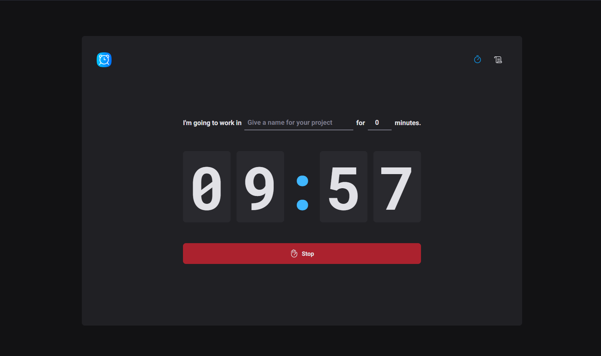
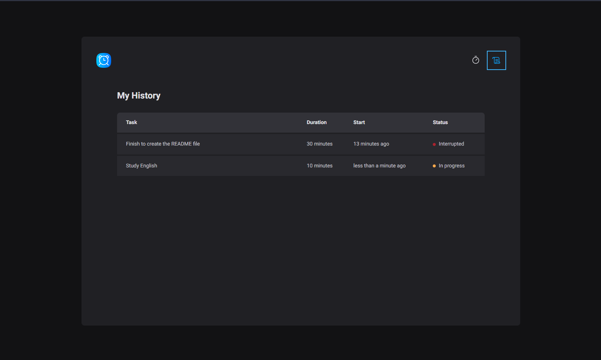

# Pomodoro

This is a pomodoro web app that allows us to create a timer and a record of all the tasks the user has worked on. In addition to the original features, new features have been added to improve the user interface or usability of the app.

### Status

Finished v1.0.0🚀

### Preview




### How to use

```sh
git clone https://github.com/vickttorugo/ignite-reactjs-timer.git
```

```sh
cd ./ignite-reactjs-timer && npm install
```

```sh
npm run dev
```

The application will run in `http://localhost:5173`

### Stack

- react
- styled-components
- react-hook-form 
- react-toastify 
- typescript
- vite
- zod
- use-sound 
- eslint
- date-fns
- framer-motion
- immer
- phosphor-react

### Author

<div>


<sub><b>Victor Silva</b></sub>🚀
</div>